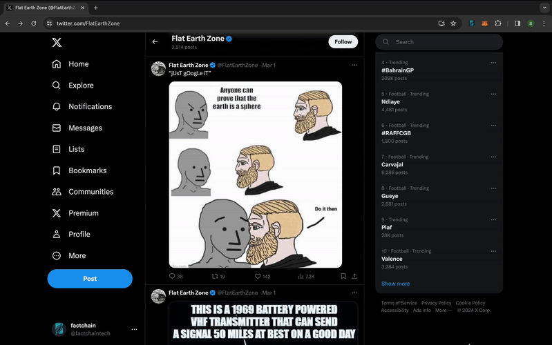
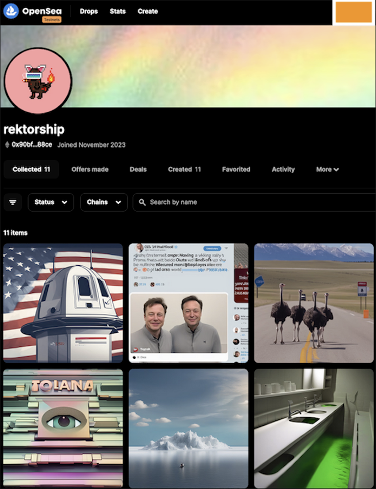
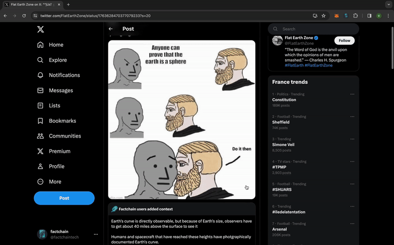
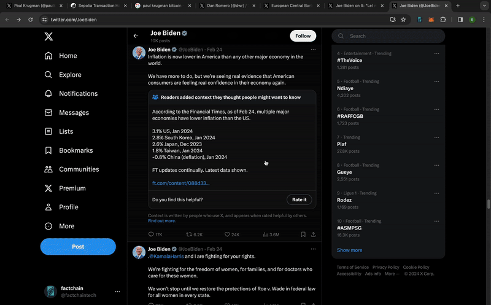

---
# Feel free to add content and custom Front Matter to this file.
# To modify the layout, see https://jekyllrb.com/docs/themes/#overriding-theme-defaults

layout: home
title: Manifesto
permalink: /
---

Factchain

# **The Fight Against Online Misinformation Rages On**
 
Misinformation on social media has plagued the user experience for years, and threatens to erode the fabric of our digital society. Centralized moderation efforts have not been effective in addressing the issue so far. A standout innovation has been the community notes feature on X, which allows contributors to add contextual notes to any post, and to rate the usefulness of notes submitted by others. An open-source algorithm then periodically evaluates these notes based on their ratings, making only those exceeding a certain score visible to all users. [Read Vitalik's blog post for details](https://vitalik.eth.limo/general/2023/08/16/communitynotes.html).
While X's community notes have paved the way, their approach still falls short in several aspects:
<ul class='container' style='display list-item;'>
<li>
they rely on a selected set of volunteers for contributions.
</li>
<li>
if you disagree with X's algorithm, there is no way for you to propose a better version.
</li>
<li>
it is impossible to audit the data used by the algorithm as X ultimately controls the storing and accessing of both Notes and Ratings.
</li>
<li>
it is limited to X and cannot be easily extended to other platforms.
</li>
</ul>
 

# **Factchain: an Ethereum-Based Truth Layer** 
 
Factchain is an immutable and transparent truth layer that supports all social platforms. It is permissionless and devoid of any central authority. 

Factchainers can add context to any post, in the form of **Notes**,  which then get rated by the community.

Useful **Notes** become visible to all Factchain users, enhancing their social media experience and shielding them from misinformation.

For their work, **Note** **Creators** and **Raters** are rewarded by the Factchain protocol, incentivising quality contributions.

## **How Does Factchain work?**
 
Anyone with an Ethereum address can create and rate Factchain Notes by calling the 
<a href="https://sepolia.etherscan.io/address/0x3b5946b3bd79c2b211e49c3149872f1d66223ae7">Factchain Community contract</a>

A rating algorithm runs regularly to assess ratings and give notes their final usefulnesss score.

All notes and ratings are stored forever onchain, which makes it easy for anyone to audit them and build a competing note scoring algorithm.

Creating and rating Notes requires an ETH stake. The funds remain locked in the contract until the finalisation period concludes, at which point they are distributed between all participants depending on the final rating of the Note: The better the Note, the better the rewards, but bad Notes will get you slashed. The goal is to give an incentive to users to create meaningful and useful Notes.

Notes that are deemed useful by the community are shown under their posts, providing context and nuance when navigating social media platforms.

# **Put Your ETH Where Your Mouth Is. Join the Guardians of Truth.**
 
As a Factchainer, you become a guardian of truth, backing your contributions with ETH. 

These economic incentives are designed to secure the network against collusion and the spread of misinformation. The Factchain Community operates on a fact-checking protocol that leaves no room for subjectivity, favoring notes that are supported by credible sources and demonstrable accuracy.

Factchainers benefit from an enhanced experience on their favorite social networks, and earn ETH while contributing to the public good. What more could you ask for? JPEGs? You're getting some too. Read on.

## [**1 - Get Started**](getting-started.md)

## **2 - Create and Rate Notes**
A note is a textual addition to a social media post, identified by its URL.
 

 

Ratings, ranging from 1 to 5, assess a note's usefulness. Factchainers can rate a note only once and cannot rate their own notes.
 

 
Creating or rating a note initiates an Ethereum transaction to call the appropriate function from the Factchain Community contract. These actions require a stake: 0.001 ETH for creating a note and 0.0001 ETH for rating. Funds are locked in the contract until the note auction period ends, during which ratings are collected.

All notes and ratings are permanently stored on the blockchain.

The Factchain browser extension facilitates transaction creation and interacts with MetaMask for signature and broadcasting. Future updates will expand wallet compatibility.

**Caution:** Ensure you download the genuine Factchain extension to avoid malicious versions that could generate harmful transactions. ⚠️

## **3 - Rewards & Penalties**
In a set period after the note creation (i.e., the note auction period), the protocol runs the scoring algorithm to assign the note its final score. When a note surpasses the earning threshold, the protocol returns the creator's initial stake along with a reward, computed in WEI using the following [logic](https://github.com/factchain/factchain-community/blob/c82cf3b11a58eb3bb80dc9ee21ec4b88076120c3/fc-community-contracts/src/FactchainCommunity.sol#L173-L181). Conversely, if a note falls below the earning threshold, the protocol returns the initial stake with a slight reduction, expressed as a slash in WEI through the following [logic](https://github.com/factchain/factchain-community/blob/c82cf3b11a58eb3bb80dc9ee21ec4b88076120c3/fc-community-contracts/src/FactchainCommunity.sol#L156-L172). The raters are rewarded or slashed based on [how close](https://github.com/factchain/factchain-community/blob/c82cf3b11a58eb3bb80dc9ee21ec4b88076120c3/fc-community-contracts/src/FactchainCommunity.sol#L189) their rating is to the final score.

**Disclaimer:** For the testnet launch, we simplified the scoring algorithm to an average of all ratings, set the note auction period to 24 hours, and arbitrarily determined the earning threshold at 3. The reward and penalty mechanisms may evolve based on user feedback before the Factchain mainnet launch.

## **4 - Get Your Truth Guardian Credentials**
Once the note is finalized, Factchain issues an NFT to the note's writer, irrespective of the final score. This unique ERC-721 token points to the below metadata on IPFS:

<ul class='container' style='display list-item;'>
<li>
The content of the note.
</li>
<li>
A unique AI-generated image derived from the note.
</li>
<li>
Attributes such as the final score and the social media post URL, following the <a href="https://docs.opensea.io/docs/metadata-standards">Opensea metadata standards</a>.
</li>
</ul>

 

 

## **5 - Collect Factchain Truth Fragments**
Raters who participate in finalizing a note through Factchain also receive an ERC-1155 limited edition version of the writer's NFT. Anyone can mint one for a few wei (The minting fee is set at 0.001 ETH at the time of writing), to collect legendary truth fragments while also demonstrate support for both the writer and Factchain. The revenue generated from minting these NFTs is shared between the note creator and the Factchain protocol. The mint supply for each note is capped at 42. You should ask Deep Thought why.
 

 

## **6 - Support X community notes authors**
As a tribute to the X community note writers, we have also made it possible to mint every X community note as an ERC-1155 token.

If you'd like to show support to anons like "Focused Earth Owl", that challenge the statements of influential figures and yet don't have a single wei from Elon to show for it, go mint this [gem](https://twitter.com/i/birdwatch/n/1730273287358263482) and all your [favorite community notes](https://twitter.com/cnviolations).
 

 
Each community note is identified by its unique URL https://twitter.com/i/birdwatch/n/noteID mapping to an NFT collection onchain, with a random token supply ranging from 1 to 42.

X community notes’ authors are anonymous. Factchain can’t derive an X user ID from an X community note author ID.
Until the community finds a [smooth ZKP solution to automate the claiming process](https://medium.com/@yacine.badiss/proving-your-community-notes-identity-with-tlsnotary-d224ebe41048), if you’re the author, please reach out on [Warpcast](https://warpcast.com/factchain) or [X](https://twitter.com/factchaintech) to claim your ETH rewards.

## **7 - Factchainomics**
**Coming soon**

## Disclaimer
Factchain Notes do not represent our viewpoint and cannot be edited or modified by our team.